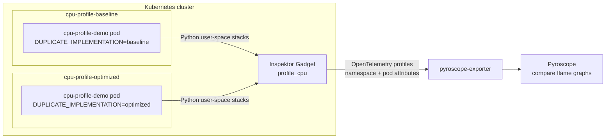
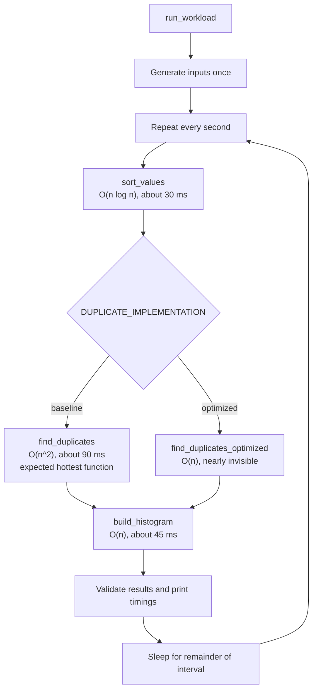
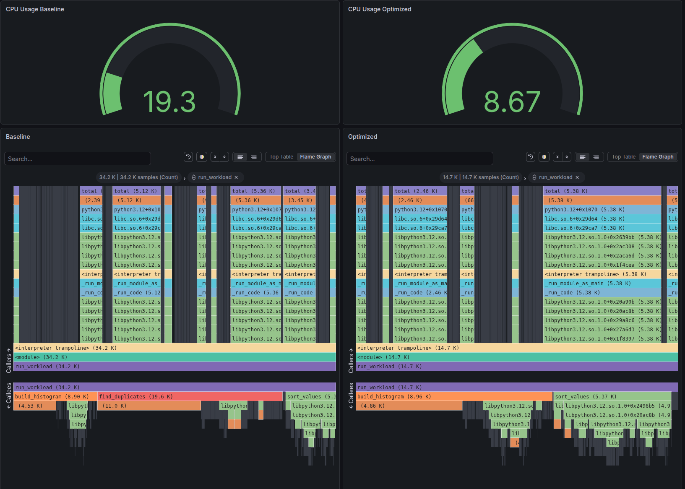

# Python CPU profiling demo

A deliberately CPU-heavy Python process for demonstrating how profiling
reveals which parts of an application consume the most CPU. One process
continuously performs three named operations:

- `sort_values`: sorts 750,000 integers.
- `find_duplicates`: finds duplicates with quadratic `O(n^2)` loops.
- `build_histogram`: groups values into histogram buckets.

The same image also includes `find_duplicates_optimized`, which uses linear
`O(n)` set lookups. Kubernetes runs the baseline and optimized workloads in
separate namespaces. There is no HTTP server or external load generator, so
profiles contain only the workload and Python runtime frames.

## Demo architecture



Each pod continuously executes the same workload pipeline; only the duplicate
detection implementation changes:



**Interesting functions during the demo:**

| Function | Component | What the profile should show |
|---|---|---|
| `run_workload` | Workload orchestrator | Parent frame connecting all three CPU operations |
| `find_duplicates` | Baseline pod | Widest application frame because of nested `O(n^2)` loops |
| `find_duplicates_optimized` | Optimized pod | Large reduction from using `set` membership checks |
| `build_histogram` | Both pods | Becomes the largest application function after optimization |
| `sort_values` | Both pods | Stable comparison frame backed by Python's built-in sorting |
| `time.sleep` | Both pods | Idle time; it should not appear as a CPU hotspot |

## Dashboard

[](images/dashboard-comparison.png)

The dashboard makes the optimization visible at both the process and function
levels. In this capture, the optimized workload uses less than half the CPU of
the baseline (`8.67` versus `19.3`). The baseline flame graph attributes
`19.6 K` samples to `find_duplicates`; that frame disappears from the optimized
profile, while `build_histogram` remains nearly unchanged at about `8.9 K`
samples and becomes the dominant application function. Click the image to view
the full-size dashboard.

## Run locally

```bash
docker build -t python-cpu-profiling-demo .
docker run --rm python-cpu-profiling-demo
```

The process reports the duration of every operation once per second.

## Deploy to Kubernetes

The public image is published as:

```text
ghcr.io/mqasimsarfraz/python-cpu-profiling-demo:latest
```

Deploy both continuous workloads:

```bash
kubectl apply -k kubernetes
kubectl rollout status deployment/cpu-profile-demo -n cpu-profile-baseline
kubectl rollout status deployment/cpu-profile-demo -n cpu-profile-optimized
kubectl get pods -n cpu-profile-baseline
kubectl get pods -n cpu-profile-optimized
```

Target the application container with your CPU profiler using the label:

```text
app.kubernetes.io/name=cpu-profile-demo
```

### Inspektor Gadget continuous profile

The `gadget/profile-cpu.yaml` ConfigMap creates a `profile_cpu` gadget instance.
It targets the application pods in both namespaces, collects Python user-space
stacks, and exports profiles through the `pyroscope-exporter` OpenTelemetry
exporter.

After installing Inspektor Gadget and configuring that exporter, apply the
profile:

```bash
kubectl apply -f gadget/profile-cpu.yaml
kubectl get configmap cpu-profile-demo-profiles -n gadget
```

Compare the profiles in Pyroscope by `k8s_namespace`:

- `cpu-profile-baseline` uses `find_duplicates`, which should be the widest and
  hottest function.
- `cpu-profile-optimized` uses `find_duplicates_optimized`, whose CPU cost
  should be nearly invisible. Histogram construction should become the largest
  application function.

Capture at least two minutes of samples. The profiler's sampling frequency is
fixed by `profile_cpu`; increasing `map-fetch-interval` only changes how often
samples are exported. The workload sizes produce roughly 90 ms of duplicate
detection, 45 ms of histogram construction, and 30 ms of sorting per cycle, so
all three functions remain visible while duplicate detection is the dominant
hotspot. The gadget uses user stacks only to omit unrelated kernel frames.

Both profiles are collected simultaneously, so use the same time range for a
direct comparison without restarting or modifying either deployment.

### CPU usage metrics

The `gadget/top-process-cpu.yaml` ConfigMap runs `top_process` every 30
seconds, filters results to the demo namespaces, and exports `cpuUsage` as a
gauge keyed by `k8s.namespace`. This provides a fresh value for each
60-second Prometheus scrape.

```bash
kubectl apply -f gadget/top-process-cpu.yaml
kubectl get configmap cpu-profile-demo-cpu-metrics -n gadget
```

Remove the demo:

```bash
kubectl delete -f gadget/top-process-cpu.yaml
kubectl delete -f gadget/profile-cpu.yaml
kubectl delete -k kubernetes
```

## Run tests

```bash
python -m unittest discover -s tests
```
